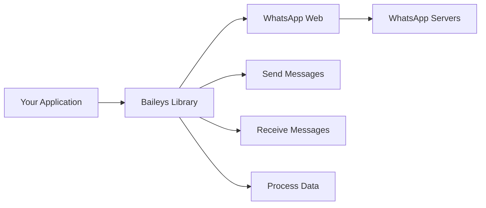

# WhatsApp - Baileys

<div align="center">


**A Powerful Node.js Library for WhatsApp Automation**

[](https://www.npmjs.com/package/@yuchiitaka/baileys)
[](https://github.com/yuchiitaka/baileys)
[](https://whatsapp.com/channel/0029Vb79RTgDOQIcmaskFd05)

</div>

## 📖 Table of Contents

- [🚀 About Baileys WhatsApp](#-about-baileys-whatsapp)
- [⚡ Installation](#-installation)
- [🎯 Features](#-features)
- [💡 Examples](#-examples)
- [🐛 Reporting Issues](#-reporting-issues)

## 🚀 About Baileys WhatsApp

Baileys WhatsApp is a powerful **Node.js library** designed to interact with WhatsApp Web automatically. This library mimics WhatsApp Web connections typically used in browsers, enabling developers to create sophisticated WhatsApp bots that can send, receive, and process messages without manual intervention.

<div align="center">



</div>

## ⚡ Installation

### 📦 Package.json Method

**Using NPM:**
```json
{
  "dependencies": {
    "@whiskeysockets/baileys": "npm:@yuchiitaka/baileys"
  }
}
```

**Using GitHub:**
```json
{
  "dependencies": {
    "@whiskeysockets/baileys": "github:yuchiitaka/baileys"
  }
}
```

### 💻 Terminal Method

**NPM Installation:**
```bash
npm install @whiskeysockets/baileys@npm:@yuchiitaka/baileys
```

**GitHub Installation:**
```bash
npm install @whiskeysockets/baileys@github:yuchiitaka/baileys
```

### 📝 Importing the Library

**ES Modules (ESM):**
```javascript
import makeWASocket from '@whiskeysockets/baileys'
```

**CommonJS (CJS):**
```javascript
const { default: makeWASocket } = require("@whiskeysockets/baileys")
```

## 🎯 Features

<div align="center">

| Feature | Icon | Description |
|---------|------|-------------|
| **Channel Messages** | 📢 | Send messages to WhatsApp channels with text & media support |
| **Interactive Messages** | 🔘 | Advanced button messages and interactive features |
| **Group Support** | 👥 | Full group @lid support with JID fixes |
| **Album Messages** | 🖼️ | Send multiple images as organized albums |
| **Custom Pairing** | 🔐 | Create and customize pairing codes |
| **Enhanced Logging** | 📋 | Cleaner, more informative libsignal logs |
| **AI Message Icons** | 🤖 | Customizable AI icons for modern messaging |
| **Full-Size Profile Pics** | 🖼️ | Upload profile pictures without cropping |
| **New Button Types** | 🆕 | Additional button message functionalities |

</div>

## 💡 Examples

### 📰 Newsletter Features

```javascript
// Get newsletter metadata
const metadata = await sock.newsletterMetadata("invite", "xxxxx")
// or
const metadata = await sock.newsletterMetadata("jid", "abcd@newsletter")
console.log(metadata)

// Update newsletter description
await sock.newsletterUpdateDescription("abcd@newsletter", "New Description")

// Update newsletter name
await sock.newsletterUpdateName("abcd@newsletter", "New Name")

// Update profile picture
await sock.newsletterUpdatePicture("abcd@newsletter", buffer)

// Remove profile picture
await sock.newsletterRemovePicture("abcd@newsletter")

// Mute/Unmute notifications
await sock.newsletterUnmute("abcd@newsletter")
await sock.newsletterMute("abcd@newsletter")

// Create newsletter
const metadata = await sock.newsletterCreate("Newsletter Name")
console.log(metadata)

// Delete newsletter
await sock.newsletterDelete("abcd@newsletter")

// Follow/Unfollow
await sock.newsletterFollow("abcd@newsletter")
await sock.newsletterUnfollow("abcd@newsletter")

// Send reactions
const id = "175" // From message URL
await sock.newsletterReactMessage("abcd@newsletter", id, "🥳")
```

### 🔘 Button & Interactive Messages

#### Basic Button Message
```javascript
const buttons = [
  { 
    buttonId: 'id1', 
    buttonText: { displayText: 'Button 1' }, 
    type: 1 
  },
  { 
    buttonId: 'id2', 
    buttonText: { displayText: 'Button 2' }, 
    type: 1 
  }
]

const buttonMessage = {
    text: "Hi it's button message",
    footer: 'Hello World',
    buttons,
    headerType: 1
}

await sock.sendMessage(id, buttonMessage, { quoted: null })
```

#### Button with Image
```javascript
const buttonMessage = {
    image: { url: "https://example.com/abcd.jpg" },
    caption: "Hi it's button message with image",
    footer: 'Hello World',
    buttons,
    headerType: 1
}

await sock.sendMessage(id, buttonMessage, { quoted: null })
```

#### Interactive Message
```javascript
const interactiveButtons = [
  {
    name: "quick_reply",
    buttonParamsJson: JSON.stringify({
      display_text: "Quick Reply",
      id: "ID"
    })
  },
  {
    name: "cta_url",
    buttonParamsJson: JSON.stringify({
      display_text: "Tap Here!",
      url: "https://www.example.com/"
    })
  },
  {
    name: "cta_copy",
    buttonParamsJson: JSON.stringify({
      display_text: "Copy Code",
      id: "12345",
      copy_code: "12345"
    })
  }
]

const interactiveMessage = {
  text: "Hello World!",
  title: "this is the title",
  footer: "this is the footer",
  interactiveButtons
}

await sock.sendMessage(id, interactiveMessage, { quoted: null })
```

#### List Interactive
```javascript
const interactiveButtons = [
  {
    name: "single_select",
    buttonParamsJson: JSON.stringify({
      title: "message",
      sections: [
        {
          title: "title",
          highlight_label: "label",
          rows: [
            {
              header: "HEADER",
              title: "TITLE",
              description: "DESCRIPTION",
              id: "YOUR ID"
            }
          ]
        }
      ]
    })
  }
]

const interactiveMessage = {
  text: "Hello World!",
  title: "this is the title",
  footer: "this is the footer",
  interactiveButtons
}

await sock.sendMessage(id, interactiveMessage, { quoted: null })
```

#### Advanced Media Button Messages
```javascript
await sock.sendMediaMessages(m.chat, {
  requestInteractiveMediaMessage: {
    body: "🔥 Promo spesial hari ini!",
    buttons: [
      { 
        name: "quick_reply", 
        buttonParamsJson: JSON.stringify({ 
          display_text: "Beli Sekarang", 
          id: "buy_1" 
        }) 
      }
    ],
    listSections: [
      {
        title: "Pilih Produk",
        rows: [
          { title: "Produk A", description: "Murah banget", id: "produk_a" },
          { title: "Produk B", description: "Diskon 50%", id: "produk_b" }
        ]
      }
    ],
    imageMessage: { url: "https://telegra.ph/file/yourimage.jpg" },
    forwardedNewsletterMessageInfo: {
      newsletterJid: global.idSaluran,
      newsletterName: global.namaSaluran
    },
    contextInfo: {
      mentionedJid: [m.sender],
      externalAdReply: {
        title: `${global.name} - ${global.version}`,
        body: `📍 Runtime: ${runtime(process.uptime())}`,
        thumbnail: global.Images,
        sourceUrl: global.linkSaluran,
        mediaType: 1,
        renderLargerThumbnail: true
      }
    }
  }
}, { quoted: m })
```

## 🐛 Reporting Issues

<div align="center">

### Found a Bug? 🐛

We're constantly improving Baileys! If you encounter any issues, please help us by reporting them.

[](https://github.com/yuchiitaka/baileys/issues)

</div>

---

<div align="center">

### 🌟 Star Us on GitHub!

If you find this project helpful, please consider giving it a star on GitHub!

[](https://github.com/yuchiitaka/baileys)

**Made with ❤️ for the WhatsApp Developer Community**

</div>

<style>
  .markdown-body {
    font-family: 'Segoe UI', Tahoma, Geneva, Verdana, sans-serif;
  }
  
  .markdown-body h1, .markdown-body h2, .markdown-body h3 {
    border-bottom: 2px solid #e1e4e8;
    padding-bottom: 0.3em;
  }
  
  .markdown-body table {
    border-collapse: collapse;
    width: 100%;
  }
  
  .markdown-body table th {
    background-color: #f6f8fa;
  }
  
  .markdown-body table th, .markdown-body table td {
    border: 1px solid #dfe2e5;
    padding: 6px 13px;
    text-align: left;
  }
  
  .markdown-body code {
    background-color: #f6f8fa;
    border-radius: 3px;
    padding: 0.2em 0.4em;
  }
</style>
